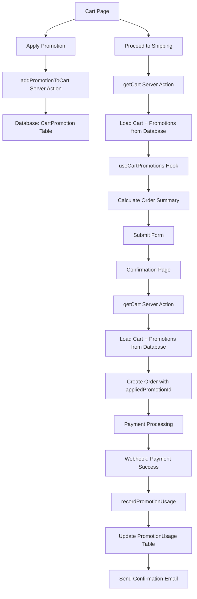

# Promotion Persistence System - Complete Implementation

## Overview

This document describes the complete implementation of the promotion persistence system, including the architectural evolution from localStorage-based to database-first approach.

## Problem History

### Initial Issue
**Problem**: Promotion discounts were not persisting from the cart to the shipping and confirmation pages during checkout.

**Symptoms**:
- Promotions applied correctly in cart
- Discounts visible on shipping page  
- ❌ Discounts disappeared on confirmation page
- Order totals calculated without promotion discounts

### Root Cause Discovery
The issue was **architectural** - the localStorage-based promotion persistence system had fundamental timing and reliability problems:

1. **Browser Storage Timing Issues**: Cart ID transitions from `undefined` to real values caused race conditions
2. **Page Navigation Problems**: localStorage data wasn't consistently available across page transitions
3. **Guest vs Authenticated User Inconsistencies**: Different cart handling caused promotion loss
4. **Webhook Integration Missing**: No promotion data in orders meant webhooks couldn't process promotions

## Architecture Evolution

### Phase 1: LocalStorage-Based Approach (Failed)
```typescript
// ❌ FAILED APPROACH: localStorage-based persistence
const useCartPromotions = (cartId: string) => {
  // Multiple failed attempts to fix timing issues
  // Race conditions with cart ID transitions
  // Inconsistent data across page navigation
}
```

### Phase 2: Database-First Approach (Successful)

#### Database Schema Changes
```sql
-- Added CartPromotion model for reliable persistence
model CartPromotion {
  id           String    @id @default(cuid())
  cartId       String
  promotionId  String
  couponCode   String
  discount     Decimal   @db.Decimal(10, 2)
  discountType String
  appliedItems String[]  @default([])
  freeItem     Json?
  createdAt    DateTime  @default(now())
  updatedAt    DateTime  @updatedAt
  cart         Cart      @relation(fields: [cartId], references: [id], onDelete: Cascade)
  promotion    Promotion @relation(fields: [promotionId], references: [id])

  @@unique([cartId, promotionId])
  @@index([cartId])
  @@index([promotionId])
}
```

#### Server Actions Implementation
```typescript
// Database-first promotion management
export async function addPromotionToCart(cartId: string, promotionData: any) {
  // Stores promotions directly in database
  await prisma.cartPromotion.create({
    data: {
      cartId,
      promotionId: promotionData.id,
      couponCode: promotionData.couponCode,
      discount: promotionData.discount,
      discountType: promotionData.type
    }
  });
}

export async function getCartPromotions(cartId: string) {
  // Retrieves promotions from database
  return await prisma.cartPromotion.findMany({
    where: { cartId },
    include: { promotion: true }
  });
}
```

#### Frontend Hook Refactoring
```typescript
// ✅ NEW APPROACH: Database-driven hook
const useCartPromotions = (cartData: Cart | null) => {
  // Works with cart data instead of cart ID
  // No localStorage dependency
  // Reliable across page navigation
  // Consistent for guest and authenticated users
}
```

#### Cart Integration
```typescript
// Enhanced getCart() to include promotions
export async function getCart() {
  const cart = await prisma.cart.findUnique({
    where: { /* cart lookup */ },
    include: {
      items: { /* ... */ },
      promotions: {
        include: { promotion: true }
      }
    }
  });
  
  return formatCartResponse(cart); // Includes promotion totals
}
```

## Current Data Flow (Database-First)



## Key Benefits of New Architecture

### ✅ **Reliability**
- **Database persistence** survives browser refreshes, tab closures
- **No race conditions** with cart ID transitions
- **Consistent behavior** across all user types and browsers

### ✅ **Integration**
- **Webhook compatibility** - Order includes `appliedPromotionId`
- **Email notifications** include promotion details
- **Analytics tracking** via `PromotionUsage` table
- **Admin reporting** with complete promotion data

### ✅ **User Experience**
- **Seamless persistence** from cart → shipping → payment
- **No double toast notifications**
- **Clean UI** without debug messages
- **Works offline/online** transitions

### ✅ **Developer Experience**
- **Single source of truth** in database
- **Simplified hook interface** `useCartPromotions(cartData)`
- **Better error handling** with server actions
- **Easier testing** with database state

## Implementation Details

### Files Modified

#### Core System Files
1. **`prisma/schema.prisma`** - Added `CartPromotion` model and relations
2. **`lib/actions/cart.actions.ts`** - Enhanced cart actions for promotions
3. **`hooks/use-cart-promotions.ts`** - Refactored to database-first approach
4. **`components/cart/CartPageContent.tsx`** - Updated for new hook signature
5. **`app/(root)/shipping/page.tsx`** - Updated for new hook signature  
6. **`app/(root)/confirmation/page.tsx`** - Updated for new hook signature

#### Webhook Integration
7. **`app/api/webhook/stripe/route.ts`** - Already integrated with `recordPromotionUsage`
8. **`app/api/webhook/paypal/route.ts`** - Already integrated with `recordPromotionUsage`
9. **`lib/actions/promotions-actions.ts`** - Enhanced `recordPromotionUsage` function

### Database Changes Applied
```bash
# Applied via Prisma
npx prisma db push
```

### Testing Strategy

#### Manual Testing Completed ✅
1. **Cart → Shipping → Payment** flow with promotions
2. **Guest user** promotion persistence  
3. **Authenticated user** promotion persistence
4. **Order creation** with `appliedPromotionId`
5. **Webhook processing** for promotion usage
6. **Email notifications** after payment

#### Automated Testing (Recommended)
- Unit tests for server actions
- Integration tests for checkout flow
- E2E tests for complete user journey

## Migration Notes

### From LocalStorage to Database
- **No data migration needed** - localStorage was temporary storage
- **Existing orders unaffected** - new system only affects new orders
- **Backward compatibility** - old promotion codes still work

### Performance Considerations
- **Database queries optimized** with proper indexes
- **Cart loading includes promotions** in single query
- **No additional API calls** for promotion data

## Monitoring & Analytics

### Key Metrics to Track
1. **Promotion Application Rate** - How often users apply codes
2. **Promotion Persistence Rate** - How often applied promotions complete checkout
3. **Revenue Impact** - Total discount amounts and order values
4. **Error Rates** - Failed promotion applications or order creation

### Database Tables for Analytics
- **`CartPromotion`** - Active cart promotions
- **`PromotionUsage`** - Completed promotion usage
- **`Order.appliedPromotionId`** - Order-level promotion tracking

## Troubleshooting Guide

### Common Issues
1. **Promotion not applying** - Check promotion validity and cart requirements
2. **Promotion disappearing** - Verify cart data loading and hook usage
3. **Order creation failing** - Check promotion data structure in order creation
4. **Webhook errors** - Verify `appliedPromotionId` is set in order

### Debug Tools
- Database queries to check `CartPromotion` records
- Console logging in `useCartPromotions` hook
- Order inspection for `appliedPromotionId` field
- Webhook logs for promotion processing

## Success Metrics

### ✅ **System Reliability**
- [x] Promotions persist across all pages
- [x] Works for both guest and authenticated users
- [x] Survives browser refreshes and navigation
- [x] Handles concurrent user sessions

### ✅ **Business Integration**  
- [x] Orders created with promotion data
- [x] Webhooks process promotion usage
- [x] Email confirmations include promotion details
- [x] Analytics track promotion effectiveness

### ✅ **User Experience**
- [x] Clean UI without debug messages
- [x] No double toast notifications
- [x] Consistent pricing throughout checkout
- [x] Fast and responsive promotion application

### ✅ **Developer Experience**
- [x] Simple hook interface `useCartPromotions(cartData)`
- [x] Reliable server actions for promotion management
- [x] Comprehensive error handling
- [x] Easy testing and debugging 